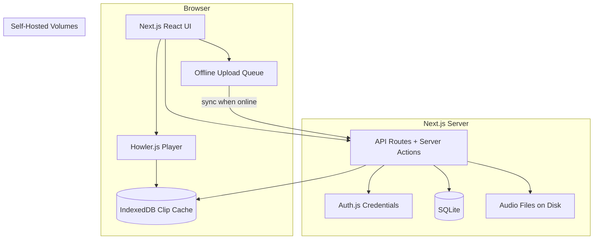
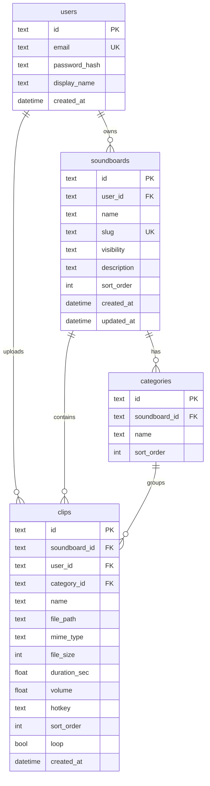

# Awesome Soundboard — Implementation Plan

Build a self-hosted Next.js soundboard app with multi-user auth, three-tier board visibility (private/unlisted/public), full playback features, and a hybrid local-first clip cache backed by SQLite and on-disk audio storage — deployable via Docker or IIS reverse proxy.

## Decisions Locked In

| Area        | Choice                                                                               |
| ----------- | ------------------------------------------------------------------------------------ |
| Users       | Multi-user with accounts                                                             |
| Sharing     | Private / Unlisted / Public — URL and access follow board status                     |
| Storage     | Hybrid: server is source of truth; browser caches clips locally                      |
| Stack       | Next.js (App Router) full-stack                                                      |
| Auth        | Email + password                                                                     |
| MVP         | Full feature set (hotkeys, volume, categories, search, waveforms, loop, global stop) |
| Deploy      | Self-hosted — Docker primary, IIS reverse-proxy supported                            |
| Database    | SQLite (single-file, volume-mounted)                                                 |
| Audio files | Local disk (`/data/uploads`)                                                         |

---

## Architecture



### URL model (visibility-driven)

| Status       | Owner                       | Others                                             |
| ------------ | --------------------------- | -------------------------------------------------- |
| **Private**  | Full edit at `/boards/[id]` | 404 / access denied                                |
| **Unlisted** | Full edit                   | Play-only at `/s/[slug]` (no gallery listing)      |
| **Public**   | Full edit                   | Play at `/s/[slug]` + listed in `/explore` gallery |

Share links always use `/s/[slug]`; the server enforces access based on `visibility` and session.

---

## Tech Stack

- **Framework**: Next.js 15 (App Router), TypeScript, Tailwind CSS
- **UI**: shadcn/ui — grid buttons, dialogs, drag-and-drop lists
- **ORM**: Drizzle ORM + `better-sqlite3` (simple self-host; no external DB service)
- **Auth**: Auth.js v5 (credentials provider, bcrypt password hashing, JWT/session cookies)
- **Audio playback**: Howler.js — reliable cross-format playback, per-clip volume, loop
- **Waveforms**: wavesurfer.js — preview on clip cards and in edit modal
- **DnD / reorder**: `@dnd-kit/core`
- **Local cache**: Dexie.js (IndexedDB) — clip blobs keyed by `clipId`, upload queue, last-synced metadata
- **Validation**: Zod on API inputs and forms

---

## Data Model



**Indexes**: `soundboards.slug`, `soundboards.visibility`, `clips.soundboard_id`, `users.email`

---

## Feature Breakdown (Full MVP)

### Soundboard management

- Create / rename / delete boards
- Set visibility (private → unlisted → public) with confirmation when going public
- Copy share link (enabled only for unlisted/public)
- Public gallery at `/explore` (public boards only, paginated)

### Clip management

- Drag-and-drop multi-file upload (mp3, wav, ogg, m4a; max ~10 MB per clip — configurable via env)
- Server-side MIME sniffing + extension allowlist
- Rename, reorder (drag), delete
- Assign to category; create/rename/delete categories
- Per-clip: volume (0–100), loop toggle, optional hotkey (keyboard, with conflict detection)
- Search/filter clips within a board (by name, category)

### Playback UI

- Responsive button grid (category tabs or sections)
- Click to play; click again or dedicated stop to stop individual clip
- **Global stop** — stops all active Howler instances
- Visual playing state on active buttons
- Hotkey listener (disabled when typing in inputs)
- Waveform thumbnail on each clip card

### Hybrid local-first sync

1. **On play**: fetch clip from server if not in IndexedDB; cache blob + metadata
2. **On subsequent play**: serve from IndexedDB (faster, works offline for previously played clips)
3. **On upload while offline**: queue in IndexedDB; background sync when `navigator.onLine`
4. **Conflict rule**: server `updated_at` wins; re-fetch if server version is newer
5. **Settings page**: "Clear local cache" button

Phase 1 can ship server-primary playback with IndexedDB write-through cache; offline upload queue is phase 1b within the same milestone.

---

## Project Structure

```
awesome-soundboard/
├── docker-compose.yml
├── Dockerfile
├── .env.example
├── drizzle/                  # migrations
├── data/                     # gitignored: sqlite + uploads (volume mount)
├── public/
├── src/
│   ├── app/
│   │   ├── (auth)/login, register
│   │   ├── (app)/dashboard, boards/[id], settings
│   │   ├── s/[slug]            # shared player (unlisted/public)
│   │   ├── explore             # public gallery
│   │   └── api/                # uploads, auth callbacks
│   ├── components/
│   │   ├── soundboard/         # ClipGrid, ClipButton, WaveformPreview
│   │   ├── upload/             # DropZone, UploadQueue
│   │   └── ui/                 # shadcn
│   ├── lib/
│   │   ├── db/                 # Drizzle schema, queries
│   │   ├── auth/               # Auth.js config
│   │   ├── audio/              # Howler manager, global stop
│   │   ├── storage/            # filesystem helpers
│   │   └── sync/               # IndexedDB (Dexie) cache layer
│   └── hooks/                  # useHotkeys, useAudioPlayer, useOfflineSync
```

---

## Key Implementation Notes

### Audio file serving

- Store files as `{userId}/{clipId}.{ext}` under `DATA_DIR/uploads/`
- Serve via authenticated API route for private assets; public/unlisted boards serve clips through a board-scoped route that checks visibility before streaming
- Set `Content-Type` and `Accept-Ranges` for seeking

### Hotkeys

- Store as single key string (e.g. `1`, `a`, `F1`)
- Global `keydown` listener with guard: skip if `event.target` is input/textarea
- Prevent duplicate hotkeys within the same board

### Slug generation

- Auto-generate from board name (`my-meme-board`) with collision suffix
- Allow owner to customize slug (validate uniqueness)

### Security

- bcrypt (cost 12) for passwords
- CSRF via Auth.js; rate-limit login and upload endpoints
- Sanitize filenames; never expose raw filesystem paths to clients
- Validate board ownership on all mutations

---

## Deployment

### Docker (primary)

```yaml
# docker-compose.yml sketch
services:
  app:
    build: .
    ports: ["3000:3000"]
    volumes:
      - ./data:/app/data        # SQLite + uploads
    environment:
      - DATABASE_URL=file:/app/data/app.db
      - UPLOAD_DIR=/app/data/uploads
      - AUTH_SECRET=...
```

- Multi-stage Dockerfile (Node 20 Alpine)
- Health check on `/api/health`
- Persistent `data/` volume

### IIS reverse proxy

- Run Docker container (or Node process via `pm2`/Windows Service)
- IIS URL Rewrite + ARR proxy `https://soundboard.local` → `http://localhost:3000`
- Increase `maxAllowedContentLength` for uploads (e.g. 20 MB)
- Document in README (not a code deliverable unless you want an `iis/web.config` sample)

---

## Implementation Phases

### Phase 1 — Foundation

- [ ] Scaffold Next.js + Tailwind + shadcn/ui
- [ ] Drizzle schema, migrations, seed script
- [ ] Auth.js: register, login, logout, protected routes
- [ ] Basic dashboard listing user's boards

### Phase 2 — Core soundboard

- [ ] Board CRUD + visibility + slug
- [ ] Clip upload API (disk storage, metadata extraction via `music-metadata` or browser-side duration)
- [ ] Editor page: grid, play/stop, global stop, volume, loop
- [ ] Shared player page `/s/[slug]` with access checks

### Phase 3 — Full MVP features

- [ ] Categories, drag-and-drop reorder, search
- [ ] Hotkeys, waveform previews
- [ ] Public explore gallery
- [ ] IndexedDB clip cache (play-through caching)

### Phase 4 — Polish + deploy

- [ ] Offline upload queue + sync indicator
- [ ] Docker + `.env.example` + README with IIS proxy notes
- [ ] Error boundaries, empty states, loading skeletons

---

## Out of Scope (v1)

- Collaborative editing (multiple editors per board)
- Real-time sync between users
- Audio trimming/editing in-browser
- Mobile native apps
- S3/MinIO storage (can add later behind a storage interface)

---

## Risks and Mitigations

| Risk                           | Mitigation                                                                     |
| ------------------------------ | ------------------------------------------------------------------------------ |
| Browser autoplay policies      | Require one user click before first play; show "Click to enable audio" overlay |
| Large libraries slow page load | Paginate clip grid; lazy-load waveforms                                        |
| SQLite write contention        | Fine for self-hosted single instance; document scale limits                    |
| Offline sync complexity        | Ship cache-first playback before upload queue; clear UX for sync status        |
